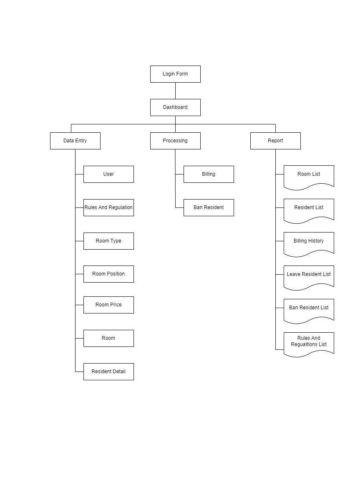
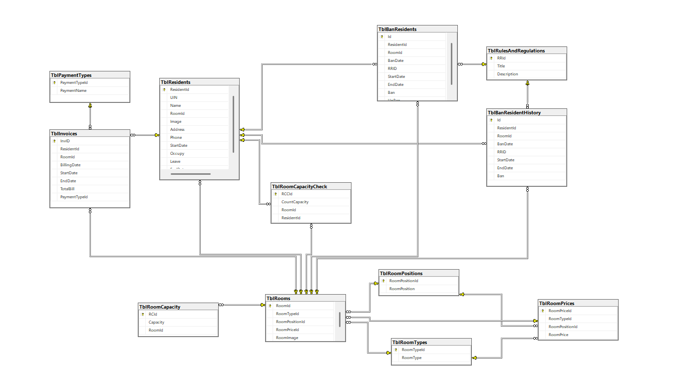
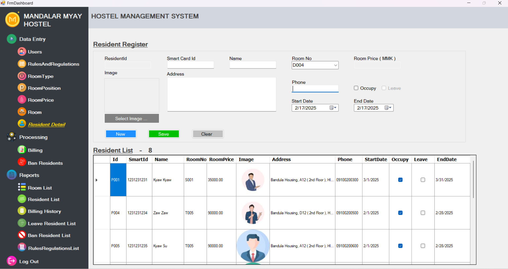

ABSTRACT 
========

  The Mandalar Myay Hostel Management System is a comprehensive software solution designed to streamline the operational processes of hostel management. It offers an efficient, user-friendly platform to manage essential functions such as room allocation, resident registration, payment tracking, and generate reports. The system is tailored to address the challenges of manual processes, reducing administrative workload while enhancing accuracy and transparency.
  Key features of the system include automated billing, digital record-keeping, resident data management, bill reporting, alerts and highlight for pending payments. The platform integrates secure data storage and retrieval mechanisms, ensuring that sensitive information is well-protected.
  By leveraging modern software technologies, this system aims to improve precise room allocation, optimize resource usage, and enhance the overall experience for both hostel administrators and residents. The Mandalar Myay Hostel Management System serves as a scalable solution adaptable to hostels of varying capacities and operational complexities, paving the way for digital transformation in hostel management.

Structure Chart for MM Hostel Management System
-----------------------------------------------

ER for MM Hostel Management System
-----------------------------------

Resident Register in Hostel Management System
----------------------------------------------

